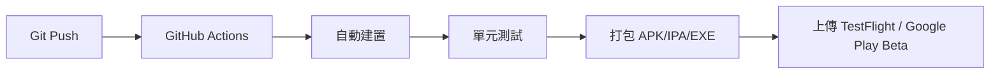

# 技術架構文件
## 《神魔：極限演武》Tower of Saviors: Tactical Overdrive

**文件版本**: 1.0
**最後更新**: 2026-02-26
**負責人**: 技術架構師

---

## 目錄
- [A. 遊戲引擎與技術堆疊選型](#a-遊戲引擎與技術堆疊選型)
- [B. 2.5D賽璐珞渲染技術方案](#b-25d賽璐珞渲染技術方案)
- [C. 3D轉珠盤動態狀態管理](#c-3d轉珠盤動態狀態管理)
- [D. 魔方介面(UI/UX)技術方案](#d-魔方介面uiux技術方案)
- [E. 跨平台同步架構](#e-跨平台同步架構)
- [F. 效能預算與優化策略](#f-效能預算與優化策略)
- [G. 開發里程碑](#g-開發里程碑)

---

## A. 遊戲引擎與技術堆疊選型

### 1. 遊戲引擎選擇：Unity (2023 LTS / Unity 6)

**選擇理由：**

基於市場調研（[Godot vs Unity vs Unreal](https://rocketbrush.com/blog/godot-vs-unity-vs-unreal-comparison)），Unity 在以下方面具有明顯優勢：

- **移動平台主導地位**：Unity 驅動全球近 50% 的移動遊戲，擁有最成熟的移動端優化工具鏈
- **跨平台效率**：從概念到可玩版本的開發速度最快，支援 PC、Android、iOS 無縫部署
- **社群與資源**：龐大的 Asset Store 和活躍社群，可快速取得 Cel-shading、UI 系統等解決方案
- **2.5D 賽璐珞渲染**：URP (Universal Render Pipeline) 原生支援 Shader Graph，適合風格化渲染
- **開發成本**：對於非營利專案，Unity Personal 版本免費且功能完整

**與競品比較：**
- **Unreal Engine**：雖然視覺保真度極高，但專注於 AAA 級寫實渲染，對於賽璐珞風格屬於「大材小用」，且移動端效能負擔較重
- **Godot 4.x**：3D 能力仍落後 Unity/Unreal（[Godot vs Unity](https://www.ediiie.com/blog/godot-vs-unity/)），對於複雜 3D 專案的圖形效果限制較多

---

### 2. 渲染管線選擇：Universal Render Pipeline (URP)

**選擇 URP 的技術原因：**

根據 [Unity URP 文件](https://unity.com/features/srp/universal-render-pipeline)和[效能優化指南](https://docs.unity3d.com/Packages/com.unity.render-pipelines.universal@14.0/manual/configure-for-better-performance.html)：

- **移動端最佳化**：單通道前向渲染 + 每物件光源剔除，draw call 數量遠低於傳統渲染
- **Shader Graph 整合**：可視化 shader 編輯器，無需手寫 HLSL/CG 即可實現複雜 Cel-shading
- **SRP Batcher**：減少 CPU 到 GPU 的設定成本，材質資料常駐 GPU 記憶體
- **可擴展性**：從低端手機到高階 PC 均可自適應調整畫質

**配置方針：**
```
- Forward Rendering (禁用 Deferred，減少移動端負擔)
- MSAA 2x/4x (根據裝置動態調整)
- HDR: 開啟 (支援後期處理效果)
- Shadow Cascades: 2 (平衡品質與效能)
```

---

### 3. 網路架構

**設計原則：單機離線為主，雲端為輔**

由於本作屬於戰術策略 RPG，核心玩法為單人劇情戰鬥，網路架構採用「離線優先 + 選擇性同步」模式：

**A. 本地資料層（核心）**
- **存檔格式**：JSON / SQLite
- **資料內容**：
  - 角色收藏、裝備、技能樹
  - 關卡進度、成就解鎖
  - 玩家偏好設定（畫質、音量、操作設定）
- **加密保護**：使用 AES-256 加密存檔防止篡改

**B. 雲端同步層（選用）**
- **平台**：Firebase / AWS Amplify
- **功能**：
  - 跨裝置存檔同步（PC ↔ 手機）
  - 雲端備份防止資料遺失
  - 版本衝突解決機制（Timestamp-based）
- **非侵入式設計**：玩家可選擇完全離線遊玩

**C. 社群功能（未來擴充）**
- **排行榜**：關卡速通時間、最高連擊數
- **玩家對戰（PvP）**：非同步對戰（提交隊伍配置，AI 模擬戰鬥）

---

### 4. 後端技術（輕量級架構）

**技術堆疊：**

| 組件 | 技術選型 | 用途 |
|------|---------|------|
| **後端框架** | Node.js + Express.js | RESTful API 伺服器 |
| **資料庫** | PostgreSQL | 儲存玩家帳號、存檔快照 |
| **快取層** | Redis | 排行榜、Session 管理 |
| **認證** | Firebase Auth / Auth0 | 帳號登入、OAuth 整合 |
| **CDN** | Cloudflare | 遊戲資源熱更新、圖片快取 |
| **監控** | Sentry | 錯誤追蹤與當機報告 |

**API 設計範例：**
```
POST /api/v1/save/upload     # 上傳存檔
GET  /api/v1/save/download   # 下載存檔
GET  /api/v1/leaderboard     # 查詢排行榜
POST /api/v1/achievements    # 解鎖成就同步
```

---

### 5. CI/CD 管線

**自動化流程：**



**工具鏈：**
- **版本控制**：Git + GitHub
- **CI/CD 平台**：GitHub Actions / GitLab CI
- **自動化測試**：Unity Test Framework (Playmode + Editmode)
- **建置腳本**：Unity Cloud Build / 本地 CLI 腳本
- **版本管理**：Semantic Versioning (v1.2.3)

**建置配置：**
- **開發版本**：每次 commit 自動測試
- **測試版本**：每週五自動打包 Alpha/Beta
- **正式版本**：手動觸發 Release 流程

---

## B. 2.5D賽璐珞渲染技術方案

### 1. Cel-Shading Shader Pipeline 設計

**技術基礎：**

根據 [Daniel Ilett 的 URP Cel-Shading 教學](https://danielilett.com/2020-03-21-tut5-1-urp-cel-shading/)和[開源專案](https://github.com/daniel-ilett/cel-shading-urp)，Cel-shading 的核心是將連續的光影漸層離散化為多個色階。

**Shader Graph 節點架構：**

```
[主光源方向] → [法線點乘] → [Posterize節點] → [色階分離]
       ↓                                        ↓
  [Diffuse色]                              [最終顏色]
       ↓                                        ↑
  [Shadow色] ────────────────────────────────→ [Lerp混合]
```

**關鍵技術實現：**

**A. 色階控制（Posterization）**
```hlsl
// 將 0-1 的連續值離散化為 N 個色階
float posterize(float value, int steps) {
    return floor(value * steps) / steps;
}

// 實際應用：
float NdotL = dot(normal, lightDir);
float toonRamp = posterize(saturate(NdotL), 3); // 3色階：亮部/中間調/暗部
```

**B. 光影分離（Separate Lighting Layers）**
- **Base Color**：角色固有色（Albedo）
- **Shadow Color**：暗部使用降低飽和度 + 色相偏移（如：偏冷藍）
- **Highlight Color**：高光使用純白或飽和色（如：動漫風高光）

**C. Fresnel Edge Glow（邊緣光）**
```hlsl
float fresnel = 1.0 - saturate(dot(normal, viewDir));
fresnel = pow(fresnel, 3); // 控制邊緣光銳利度
color += fresnel * rimColor * rimIntensity;
```

---

### 2. 描邊演算法（Outline）

**方法選擇：Inverted Hull（反轉外殼法）**

**技術原理：**
1. 複製模型並沿法線向外擴張
2. 反轉背面裁剪（Cull Front）
3. 渲染純黑色（或自訂描邊色）

**優勢：**
- 效能優秀（僅增加 1 個 draw call）
- 描邊粗細可控（adjustable thickness）
- 不受螢幕解析度影響

**Shader 實現（Vertex Shader）：**
```hlsl
// Pass 1: 描邊
v2f vert(appdata v) {
    v2f o;
    float3 normal = normalize(v.normal);
    float3 offset = normal * _OutlineWidth; // 描邊粗細
    o.vertex = UnityObjectToClipPos(v.vertex + offset);
    return o;
}

fixed4 frag(v2f i) : SV_Target {
    return _OutlineColor; // 描邊顏色
}
```

**替代方案：Post-Process Sobel Edge Detection**
- 用於特殊場景（如：漫畫分鏡效果）
- 效能成本較高，手機端慎用

---

### 3. 手機端效能優化策略

**優化目標：60 FPS @ Snapdragon 778G / A14 Bionic**

**A. Shader 編譯優化**
```csharp
// Unity Shader 變體優化
#pragma multi_compile _ _MAIN_LIGHT_SHADOWS
#pragma multi_compile _ _ADDITIONAL_LIGHTS
#pragma skip_variants FOG_LINEAR FOG_EXP FOG_EXP2 // 移除不必要的變體
```

**B. 材質實例化（GPU Instancing）**
- 對於大量相同模型（如：敵兵、符石），啟用 GPU Instancing
- 減少 draw call 至原本的 1/10

**C. LOD (Level of Detail) 系統**
```
LOD 0 (近距離): 完整模型 + Cel-shading + 描邊
LOD 1 (中距離): 簡化模型 + Cel-shading (無描邊)
LOD 2 (遠距離): 極簡模型 + Unlit Shader
```

**D. 動態解析度調整**
```csharp
// 根據 FPS 動態調整渲染解析度
if (frameRate < 50) {
    UniversalRenderPipeline.asset.renderScale = 0.85f;
}
```

**E. Shader Graph → HLSL 轉換**
- 原型開發使用 Shader Graph
- 正式版將關鍵 Shader 手寫為 HLSL 程式碼以減少節點開銷

---

### 4. 參考案例與效能基準

**業界參考：**
- **原神 (Genshin Impact)**：URP + Cel-shading，60 FPS @ 中高階手機
- **崩壞3rd (Honkai Impact 3rd)**：自訂渲染器，賽璐珞風格
- **Zenless Zone Zero**：Anime-style rendering，高品質後期處理

**效能基準測試（Unity Profiler）：**
```
目標平台: Xiaomi 12 (Snapdragon 8 Gen 1)
- Draw Calls: < 500
- Batches: < 200
- GPU Time: < 12ms (維持 60 FPS)
- 記憶體: < 2GB
```

---

## C. 3D轉珠盤動態狀態管理

### 1. 符石的3D物理表現

**物理引擎選擇：Unity Physics + 自訂邏輯**

**A. 重力與掉落**
```csharp
// 符石掉落時的物理模擬
public class RunePhysics : MonoBehaviour {
    private Rigidbody rb;

    void Start() {
        rb = GetComponent<Rigidbody>();
        rb.useGravity = true;
        rb.mass = 0.1f; // 輕量設定，加快掉落速度
    }

    // 掉落加速度：9.8 m/s² → 15 m/s² (更有打擊感)
    void FixedUpdate() {
        rb.AddForce(Vector3.down * 15f, ForceMode.Acceleration);
    }
}
```

**B. 碰撞與反彈**
- **Collider 配置**：BoxCollider（計算效率高）
- **物理材質**：Bouncy Material（彈力係數 0.3，模擬符石碰撞感）
- **音效觸發**：OnCollisionEnter 播放「叮噹」音效

**C. 磁吸效果（Snap to Grid）**
```csharp
// 符石掉落到格子時的磁吸對齊
void OnTriggerEnter(Collider other) {
    if (other.CompareTag("RuneSlot")) {
        // 平滑插值移動到格子中心
        Vector3 targetPos = other.transform.position;
        transform.DOMove(targetPos, 0.2f).SetEase(Ease.OutBack);

        // 禁用物理，防止繼續掉落
        rb.isKinematic = true;
    }
}
```

---

### 2. 消除動畫的粒子系統設計

**粒子效果架構：**

**A. 符石消除爆炸（Elimination Burst）**
```
粒子系統配置：
- Shape: Sphere (球形發射)
- Emission: Burst 20-30 particles
- Lifetime: 0.5s
- Size Over Lifetime: 1.0 → 0 (淡出)
- Color Over Lifetime: 符石顏色 → 白色 → 透明
- Velocity: Random Outward (向外爆炸)
```

**B. 連鎖反應特效（Combo Chain Effect）**
```csharp
// 連鎖數愈高，粒子效果愈誇張
void TriggerComboEffect(int comboCount) {
    ParticleSystem ps = comboParticles[comboCount / 5]; // 每 5 Combo 升級特效
    ps.Play();

    // 相機震動強度隨 Combo 增加
    CameraShake.Shake(0.1f + comboCount * 0.02f, 0.3f);
}
```

**C. 符石軌跡特效（Drag Trail）**
- **Trail Renderer 配置**：
  - Width: 0.3 → 0.05 (由粗到細)
  - Time: 0.3s (軌跡持續時間)
  - Material: Additive Shader (發光效果)
  - Color Gradient: 符石顏色 + 高飽和度

**D. 殘影效果（Motion Blur Trail）**
```csharp
// 使用物件池生成殘影
public class MotionTrailGenerator : MonoBehaviour {
    public GameObject trailPrefab;
    private Queue<GameObject> trailPool = new Queue<GameObject>();

    void Update() {
        if (isDragging) {
            GameObject trail = GetTrailFromPool();
            trail.transform.position = this.transform.position;
            trail.GetComponent<MeshRenderer>().material.color =
                new Color(runeColor.r, runeColor.g, runeColor.b, 0.5f);

            // 0.2 秒後淡出
            StartCoroutine(FadeOutTrail(trail, 0.2f));
        }
    }
}
```

---

### 3. 連鎖反應的狀態機架構

**狀態機設計（Finite State Machine）：**

```
[待機狀態] → [玩家拖曳] → [計算消除] → [符石消除動畫]
                                ↓
                          [檢查連鎖] → 有新消除？ → [重複循環]
                                ↓              ↓
                            [結算傷害]        無 → [回到待機]
```

**程式碼實現：**
```csharp
public enum BoardState {
    Idle,           // 待機
    PlayerInput,    // 玩家操作中
    Calculating,    // 計算消除組合
    Eliminating,    // 播放消除動畫
    Refilling,      // 符石補充
    ChainCheck      // 檢查連鎖
}

public class RuneBoardStateMachine : MonoBehaviour {
    private BoardState currentState = BoardState.Idle;

    void Update() {
        switch (currentState) {
            case BoardState.Idle:
                if (Input.GetMouseButtonDown(0)) {
                    currentState = BoardState.PlayerInput;
                }
                break;

            case BoardState.PlayerInput:
                HandleRuneDrag();
                if (Input.GetMouseButtonUp(0)) {
                    currentState = BoardState.Calculating;
                }
                break;

            case BoardState.Calculating:
                List<Match> matches = FindMatches();
                if (matches.Count > 0) {
                    currentState = BoardState.Eliminating;
                    StartCoroutine(EliminateRunes(matches));
                }
                break;

            // ... 其他狀態處理
        }
    }
}
```

---

### 4. 轉珠操作的觸控/滑鼠輸入處理

**跨平台輸入抽象層：**

```csharp
// 統一處理觸控與滑鼠輸入
public class InputManager : MonoBehaviour {
    public static Vector2 GetPointerPosition() {
        #if UNITY_EDITOR || UNITY_STANDALONE
            return Input.mousePosition;
        #else
            if (Input.touchCount > 0) {
                return Input.GetTouch(0).position;
            }
            return Vector2.zero;
        #endif
    }

    public static bool GetPointerDown() {
        #if UNITY_EDITOR || UNITY_STANDALONE
            return Input.GetMouseButtonDown(0);
        #else
            return Input.touchCount > 0 && Input.GetTouch(0).phase == TouchPhase.Began;
        #endif
    }
}
```

**拖曳檢測與防誤觸：**
```csharp
private Vector2 dragStartPos;
private const float MIN_DRAG_DISTANCE = 10f; // 最小拖曳距離（像素）

void OnPointerDown(PointerEventData eventData) {
    dragStartPos = eventData.position;
}

void OnDrag(PointerEventData eventData) {
    float distance = Vector2.Distance(dragStartPos, eventData.position);
    if (distance > MIN_DRAG_DISTANCE) {
        // 確認為拖曳操作，開始移動符石
        MoveRuneToPointer(eventData.position);
    }
}
```

**手感優化：**
- **觸控區域擴大**：符石的 Collider 比視覺尺寸大 20%，降低點擊失敗率
- **拖曳延遲**：0.05 秒的「確認延遲」防止誤觸
- **震動回饋**：消除時觸發手機震動（Haptic Feedback）

---

### 5. 殘影軌跡的渲染技術

**方法選擇：Trail Renderer + Shader 效果**

**A. Trail Renderer 配置**
```csharp
TrailRenderer trail = GetComponent<TrailRenderer>();
trail.time = 0.3f;                    // 軌跡持續 0.3 秒
trail.startWidth = 0.5f;              // 起始寬度
trail.endWidth = 0.1f;                // 結束寬度
trail.material = glowMaterial;        // 發光材質
trail.numCornerVertices = 5;          // 轉角平滑度
trail.minVertexDistance = 0.1f;       // 頂點生成間隔
```

**B. 自訂 Shader 效果（UV 流動 + 發光）**
```hlsl
// Trail Shader (URP Shader Graph 轉換)
Shader "Custom/RuneTrail" {
    Properties {
        _MainTex ("Trail Texture", 2D) = "white" {}
        _Color ("Trail Color", Color) = (1,1,1,1)
        _EmissionStrength ("Emission Strength", Float) = 2.0
        _ScrollSpeed ("Scroll Speed", Float) = 1.0
    }

    SubShader {
        Tags { "RenderType"="Transparent" "Queue"="Transparent" }
        Blend SrcAlpha OneMinusSrcAlpha

        Pass {
            HLSLPROGRAM
            // UV 沿軌跡滾動，製造「能量流動」效果
            float2 uv = i.uv;
            uv.x += _Time.y * _ScrollSpeed;
            float4 texColor = SAMPLE_TEXTURE2D(_MainTex, sampler_MainTex, uv);

            // 發光效果
            float3 emission = texColor.rgb * _Color.rgb * _EmissionStrength;
            return float4(emission, texColor.a * _Color.a);
            ENDHLSL
        }
    }
}
```

**C. 效能優化**
- **物件池**：預先生成 20 個 Trail Renderer，避免運行時實例化
- **動態 LOD**：低階裝置減少 `numCornerVertices` 至 3
- **條件渲染**：僅在玩家拖曳時啟用 Trail Renderer

---

## D. 魔方介面(UI/UX)技術方案

### 1. 3D旋轉UI的實現方式

**架構選擇：World Space Canvas + DOTween 動畫**

根據 [Unity World Space UI 教學](https://unity.com/resources/how-to-create-world-space-ui-toolkit)和[UI 最佳實踐](https://dev.to/marbleit/unity-ui-system-best-practices-2o24)，魔方介面採用以下實現方式：

**A. Canvas 配置**
```csharp
Canvas canvas = GetComponent<Canvas>();
canvas.renderMode = RenderMode.WorldSpace; // 3D 空間渲染
canvas.worldCamera = Camera.main;

RectTransform rt = canvas.GetComponent<RectTransform>();
rt.sizeDelta = new Vector2(1920, 1080); // 固定尺寸
rt.localScale = Vector3.one * 0.001f;   // 縮放至合適大小
```

**B. 魔方六面佈局**
```
         [隊伍]
            ↑
[商店] ← [主選單] → [圖鑑]
            ↓
         [關卡]

底面：[設定]
```

**C. 旋轉動畫（DOTween）**
```csharp
using DG.Tweening;

public class RubikCubeUI : MonoBehaviour {
    public Transform cubeRoot;
    private int currentFace = 0; // 0=主選單, 1=隊伍, 2=關卡...

    public void RotateToFace(int targetFace) {
        Vector3 targetRotation = GetFaceRotation(targetFace);

        // 平滑旋轉至目標面
        cubeRoot.DORotate(targetRotation, 0.8f)
            .SetEase(Ease.OutCubic)
            .OnComplete(() => {
                currentFace = targetFace;
                OnFaceChanged();
            });

        // 音效
        AudioManager.Play("UI_CubeRotate");
    }

    Vector3 GetFaceRotation(int face) {
        switch (face) {
            case 0: return Vector3.zero;              // 主選單（前面）
            case 1: return new Vector3(-90, 0, 0);    // 隊伍（上面）
            case 2: return new Vector3(90, 0, 0);     // 關卡（下面）
            case 3: return new Vector3(0, -90, 0);    // 商店（左面）
            case 4: return new Vector3(0, 90, 0);     // 圖鑑（右面）
            case 5: return new Vector3(180, 0, 0);    // 設定（後面）
            default: return Vector3.zero;
        }
    }
}
```

---

### 2. UI與遊戲場景的無縫切換

**場景管理策略：Additive Scene Loading**

```csharp
using UnityEngine.SceneManagement;

public class SceneTransitionManager : MonoBehaviour {
    // 載入關卡場景（不卸載 UI）
    public IEnumerator LoadBattleScene(int stageID) {
        // 淡出效果
        yield return FadeOut(0.5f);

        // 載入戰鬥場景（Additive 模式保留 UI）
        AsyncOperation asyncLoad = SceneManager.LoadSceneAsync(
            $"Battle_Stage_{stageID}",
            LoadSceneMode.Additive
        );

        while (!asyncLoad.isDone) {
            // 顯示進度條
            loadingBar.fillAmount = asyncLoad.progress;
            yield return null;
        }

        // 隱藏魔方 UI，顯示戰鬥 UI
        rubikCubeUI.SetActive(false);
        battleUI.SetActive(true);

        // 淡入效果
        yield return FadeIn(0.5f);
    }

    // 返回主選單
    public void ReturnToMainMenu() {
        StartCoroutine(UnloadBattleScene());
    }

    IEnumerator UnloadBattleScene() {
        yield return FadeOut(0.5f);

        // 卸載戰鬥場景
        SceneManager.UnloadSceneAsync("Battle_Stage_XX");

        // 重新顯示魔方 UI
        rubikCubeUI.SetActive(true);
        battleUI.SetActive(false);

        yield return FadeIn(0.5f);
    }
}
```

**效能優化：**
- **預載入**：主選單空閒時預先載入常用場景的 AssetBundle
- **漸進式卸載**：戰鬥結束後延遲 2 秒卸載場景，避免突然卡頓

---

### 3. 手機端的觸控手勢設計

**手勢識別系統：**

```csharp
public class GestureDetector : MonoBehaviour {
    private Vector2 swipeStart;
    private const float SWIPE_THRESHOLD = 100f; // 最小滑動距離

    void Update() {
        // 偵測滑動方向
        if (Input.touchCount > 0) {
            Touch touch = Input.GetTouch(0);

            switch (touch.phase) {
                case TouchPhase.Began:
                    swipeStart = touch.position;
                    break;

                case TouchPhase.Ended:
                    Vector2 swipeEnd = touch.position;
                    Vector2 swipeDelta = swipeEnd - swipeStart;

                    if (swipeDelta.magnitude > SWIPE_THRESHOLD) {
                        DetectSwipeDirection(swipeDelta);
                    }
                    break;
            }
        }
    }

    void DetectSwipeDirection(Vector2 delta) {
        float angle = Mathf.Atan2(delta.y, delta.x) * Mathf.Rad2Deg;

        if (angle >= -45 && angle < 45) {
            // 向右滑動 → 旋轉至右面（圖鑑）
            RubikCubeUI.Instance.RotateToFace(4);
        } else if (angle >= 45 && angle < 135) {
            // 向上滑動 → 旋轉至上面（隊伍）
            RubikCubeUI.Instance.RotateToFace(1);
        }
        // ... 其他方向
    }
}
```

**手勢映射表：**
| 手勢 | 操作 | 目標面 |
|------|------|--------|
| 向上滑動 | 旋轉至上面 | 隊伍編成 |
| 向下滑動 | 旋轉至下面 | 關卡選擇 |
| 向左滑動 | 旋轉至左面 | 商店 |
| 向右滑動 | 旋轉至右面 | 圖鑑 |
| 雙指捏合 | 返回主選單 | 中心面 |
| 長按 | 快速選單 | 懸浮 UI |

> ⚠️ **手勢衝突防護**：魔方旋轉手勢與符石拖曳操作存在潛在衝突（向上滑動可能被誤判）。採用情境感知輸入解決：

**情境感知輸入系統（Context-Aware Input）**：
```csharp
// 根據觸控位置動態決定手勢行為，防止誤觸
public class ContextAwareInputManager : MonoBehaviour {
    [SerializeField] private RectTransform orbBoardArea;
    [SerializeField] private GestureHandler cubeRotationHandler;
    [SerializeField] private OrbDragHandler orbDragHandler;

    void Update() {
        if (Input.touchCount > 0) {
            Touch touch = Input.GetTouch(0);
            bool isOnOrbBoard = RectTransformUtility.RectangleContainsScreenPoint(
                orbBoardArea, touch.position, Camera.main);

            // 符石盤區域：禁用魔方旋轉，啟用轉珠
            cubeRotationHandler.enabled = !isOnOrbBoard;
            orbDragHandler.enabled = isOnOrbBoard;
        }
    }
}
```

**設計原則**：
- 戰鬥場景中，魔方旋轉手勢**完全禁用**（改用螢幕角落的快捷按鈕導航）
- 主選單場景中，才啟用完整6方向手勢系統
- 快捷導航按鈕（螢幕四角）作為滑動手勢的補充替代方案

---

### 4. 無障礙設計考量

**A. 視覺無障礙**
- **色盲模式**：提供 Deuteranopia（綠色盲）、Protanopia（紅色盲）濾鏡
- **高對比模式**：UI 文字與背景對比度 ≥ 4.5:1（WCAG AA 標準）
- **字體大小調整**：支援 80% - 150% 縮放

**B. 聽覺無障礙**
- **字幕系統**：所有語音對話顯示字幕
- **視覺提示**：音效觸發時顯示螢幕邊緣閃爍（如：受擊時紅色閃爍）

**C. 操作無障礙**
- **單手模式**：UI 重要按鈕集中在螢幕下半部
- **自動戰鬥**：提供 AI 代打選項
- **可自訂按鈕大小**：最小觸控區域 48x48 dp（Google Material Design 標準）

**D. 認知無障礙**
- **新手教學**：可重複播放，永久可查閱
- **複雜度標記**：關卡顯示難度星級與機制提示
- **遊戲暫停**：任何時候可暫停並查看狀態說明

---

## E. 跨平台同步架構

### 1. PC/Mobile的輸入差異處理

**輸入抽象層設計：**

```csharp
// IInputProvider 介面
public interface IInputProvider {
    Vector2 GetPointerPosition();
    bool GetPointerDown();
    bool GetPointerUp();
    bool IsPointerPressed();
}

// PC 滑鼠輸入
public class MouseInputProvider : IInputProvider {
    public Vector2 GetPointerPosition() => Input.mousePosition;
    public bool GetPointerDown() => Input.GetMouseButtonDown(0);
    public bool GetPointerUp() => Input.GetMouseButtonUp(0);
    public bool IsPointerPressed() => Input.GetMouseButton(0);
}

// 手機觸控輸入
public class TouchInputProvider : IInputProvider {
    public Vector2 GetPointerPosition() {
        return Input.touchCount > 0 ? Input.GetTouch(0).position : Vector2.zero;
    }
    public bool GetPointerDown() {
        return Input.touchCount > 0 && Input.GetTouch(0).phase == TouchPhase.Began;
    }
    public bool GetPointerUp() {
        return Input.touchCount > 0 && Input.GetTouch(0).phase == TouchPhase.Ended;
    }
    public bool IsPointerPressed() {
        return Input.touchCount > 0;
    }
}

// 自動選擇輸入提供者
public class InputManager {
    private static IInputProvider provider;

    static InputManager() {
        #if UNITY_ANDROID || UNITY_IOS
            provider = new TouchInputProvider();
        #else
            provider = new MouseInputProvider();
        #endif
    }

    public static Vector2 PointerPosition => provider.GetPointerPosition();
    // ... 其他方法
}
```

---

### 2. 畫質分級與自適應渲染

**裝置分級系統：**

```csharp
public enum DeviceTier {
    Low,      // 低階手機（Snapdragon 6xx, A12以下）
    Medium,   // 中階手機（Snapdragon 7xx, A13-A14）
    High,     // 高階手機（Snapdragon 8xx, A15+）
    Ultra     // PC / 旗艦手機
}

public class QualityManager : MonoBehaviour {
    private DeviceTier deviceTier;

    void Start() {
        deviceTier = DetectDeviceTier();
        ApplyQualitySettings(deviceTier);
    }

    DeviceTier DetectDeviceTier() {
        int ram = SystemInfo.systemMemorySize;
        int gpuMemory = SystemInfo.graphicsMemorySize;

        if (Application.platform == RuntimePlatform.WindowsPlayer) {
            return DeviceTier.Ultra;
        }

        if (ram >= 8000 && gpuMemory >= 4000) return DeviceTier.High;
        if (ram >= 6000 && gpuMemory >= 2000) return DeviceTier.Medium;
        return DeviceTier.Low;
    }

    void ApplyQualitySettings(DeviceTier tier) {
        var urpAsset = (UniversalRenderPipelineAsset)QualitySettings.renderPipeline;

        switch (tier) {
            case DeviceTier.Low:
                urpAsset.renderScale = 0.75f;
                urpAsset.msaaSampleCount = 0;        // 關閉 MSAA
                urpAsset.shadowDistance = 30f;
                QualitySettings.shadows = ShadowQuality.HardOnly;
                Application.targetFrameRate = 30;    // 30 FPS 模式
                break;

            case DeviceTier.Medium:
                urpAsset.renderScale = 0.9f;
                urpAsset.msaaSampleCount = 2;        // 2x MSAA
                urpAsset.shadowDistance = 50f;
                QualitySettings.shadows = ShadowQuality.All;
                Application.targetFrameRate = 60;
                break;

            case DeviceTier.High:
                urpAsset.renderScale = 1.0f;
                urpAsset.msaaSampleCount = 4;        // 4x MSAA
                urpAsset.shadowDistance = 80f;
                EnablePostProcessing(true);
                Application.targetFrameRate = 60;
                break;

            case DeviceTier.Ultra:
                urpAsset.renderScale = 1.2f;         // 超採樣
                urpAsset.msaaSampleCount = 4;
                urpAsset.shadowDistance = 120f;
                EnablePostProcessing(true);
                EnableAdvancedEffects(true);         // Bloom, DOF, Motion Blur
                Application.targetFrameRate = -1;    // 無限制
                break;
        }
    }
}
```

**動態解析度調整：**
```csharp
// 根據實時 FPS 調整渲染解析度
void Update() {
    float currentFPS = 1.0f / Time.deltaTime;

    if (currentFPS < targetFPS - 5) {
        // FPS 過低，降低解析度
        renderScale = Mathf.Max(0.6f, renderScale - 0.05f);
    } else if (currentFPS > targetFPS + 5) {
        // FPS 過高，提升解析度
        renderScale = Mathf.Min(1.2f, renderScale + 0.02f);
    }

    UniversalRenderPipeline.asset.renderScale = renderScale;
}
```

---

### 3. 存檔同步方案

**架構：本地優先 + 雲端備份**

參考 [Arknights: Endfield 的跨平台進度系統](https://www.eneba.com/hub/news/arknights-breaks-mobile-exclusivity-with-3d-factory-building-hybrid/)：

**A. 存檔格式（JSON）**
```json
{
  "version": "1.0.0",
  "playerID": "uuid-1234",
  "lastModified": 1709088000,
  "data": {
    "profile": {
      "name": "玩家名稱",
      "level": 45,
      "exp": 12500
    },
    "inventory": {
      "characters": [...],
      "equipment": [...],
      "resources": {...}
    },
    "progress": {
      "completedStages": [1, 2, 3, ...],
      "achievements": [...]
    }
  },
  "checksum": "sha256-hash" // 防止存檔篡改
}
```

**B. 同步邏輯**
```csharp
public class SaveSyncManager : MonoBehaviour {
    private SaveData localSave;
    private SaveData cloudSave;

    public async Task SyncSaveData() {
        // 1. 載入本地存檔
        localSave = LoadLocalSave();

        // 2. 從雲端下載存檔
        cloudSave = await DownloadCloudSave();

        // 3. 比較時間戳，選擇最新的
        if (localSave.lastModified > cloudSave.lastModified) {
            // 本地較新，上傳至雲端
            await UploadCloudSave(localSave);
            Debug.Log("本地存檔已同步至雲端");
        } else if (cloudSave.lastModified > localSave.lastModified) {
            // 雲端較新，下載至本地
            SaveLocalSave(cloudSave);
            Debug.Log("雲端存檔已同步至本地");
        } else {
            Debug.Log("存檔已是最新版本");
        }
    }

    // 處理衝突（例如：兩台裝置都離線更新）
    void ResolveConflict(SaveData local, SaveData cloud) {
        // 顯示衝突解決 UI，讓玩家選擇：
        // 選項 1: 使用本地存檔
        // 選項 2: 使用雲端存檔
        // 選項 3: 合併存檔（僅合併資源，進度取最高）
    }
}
```

**C. 自動存檔觸發時機**
- 關卡完成後
- 角色強化/升級後
- 購買/使用道具後
- 每 5 分鐘自動存檔一次
- APP 進入背景時

---

### 4. 非營利模式下的伺服器成本控制

**設計原則：本地優先，雲端可選，社群自主**

非營利模式下，長期伺服器費用需謹慎規劃：

**A. 完全離線優先設計**
- 所有核心玩法均可**完全離線**遊玩（無法律強制性聯網）
- 雲端存檔同步為「選用功能」，非核心遊玩所必須
- 若伺服器停止運營，遊戲功能不受影響（僅失去跨裝置同步）

**B. 透明成本與捐款機制**
- 官網公示每月伺服器實際運營費用
- 建立捐款頁面，目標金額 = 當月費用
- 若連續3個月捐款未達標，提前60天公告並引導玩家備份本地存檔
- 目標：每位活躍玩家平均貢獻 < USD $0.10/月

**C. 社群自架伺服器**
- 開放服務端程式碼（開源）
- 提供完整的自架教學文件
- 玩家社群可自架私服，脫離官方伺服器依賴
- 去中心化設計避免「伺服器關閉即存檔消失」的問題

**D. 費用估算（10萬活躍玩家）**

| 服務 | 月費估算 |
|-----|---------|
| Firebase（雲端存檔同步） | USD $200-500 |
| CDN（熱更新資源） | USD $100-200 |
| Sentry（錯誤追蹤） | USD $50-100 |
| **總計** | **USD $350-800/月** |

> 優先考慮免費層方案（Firebase Spark Plan、Cloudflare Free Tier），在玩家規模小時盡量控制在 $200/月以下。

---

### 5. 熱更新機制

**AssetBundle 熱更新架構：**

```csharp
public class HotfixManager : MonoBehaviour {
    private const string CDN_URL = "https://cdn.example.com/tos/";

    public async Task CheckForUpdates() {
        // 1. 從伺服器獲取版本資訊
        VersionInfo remoteVersion = await GetRemoteVersion();
        VersionInfo localVersion = GetLocalVersion();

        if (remoteVersion.buildNumber > localVersion.buildNumber) {
            // 2. 下載更新列表
            List<string> filesToUpdate = await GetUpdateList(remoteVersion);

            // 3. 下載並替換 AssetBundle
            foreach (string file in filesToUpdate) {
                await DownloadAssetBundle(file);
            }

            // 4. 更新版本號
            SaveLocalVersion(remoteVersion);

            // 5. 提示玩家重啟遊戲
            ShowRestartDialog();
        }
    }

    async Task<AssetBundle> DownloadAssetBundle(string fileName) {
        string url = CDN_URL + fileName;
        UnityWebRequest request = UnityWebRequestAssetBundle.GetAssetBundle(url);

        await request.SendWebRequest();

        if (request.result == UnityWebRequest.Result.Success) {
            AssetBundle bundle = DownloadHandlerAssetBundle.GetContent(request);
            SaveToCache(fileName, bundle);
            return bundle;
        } else {
            Debug.LogError($"下載失敗：{fileName}");
            return null;
        }
    }
}
```

**可熱更新內容：**
- 關卡資料（地圖、敵人配置）
- 角色數值（平衡性調整）
- UI 美術資源
- 音效與音樂
- 文本翻譯檔

**不可熱更新內容（需重新下載 APP）：**
- 核心程式碼邏輯
- 引擎版本升級
- 新功能的底層框架

---

## F. 效能預算與優化策略

### 1. 目標硬體規格

**極簡模式（Legacy Tier）：**
- **手機**：Snapdragon 665 / MediaTek Helio G90T / Apple A12
- **RAM**：4GB
- **儲存空間**：3GB
- **目標效能**：30 FPS @ 720p
- **限制**：關閉Cel-shading描邊、禁用粒子特效、符石盤改為2D渲染、不支援天氣/晝夜系統
- ⚠️ **注意**：此等級僅保證**核心玩法可運行**，視覺體驗大幅降低。

**最低配備（Low Tier — 完整視覺體驗的真正最低需求）：**
- **手機**：Snapdragon 778G / MediaTek Dimensity 900 / Apple A13
- **RAM**：4GB
- **儲存空間**：4GB
- **目標效能**：30 FPS @ 1080p（Cel-shading + 基本粒子效果）

**推薦配備（Medium Tier）：**
- **手機**：Snapdragon 778G / MediaTek Dimensity 8100 / Apple A14
- **RAM**：6GB
- **儲存空間**：5GB
- **目標效能**：60 FPS @ 1080p

**高階配備（High/Ultra Tier）：**
- **手機**：Snapdragon 8 Gen 2+ / Apple A16+
- **PC**：GTX 1060 / RX 580 以上
- **RAM**：8GB+
- **目標效能**：60 FPS @ 1080p+ (手機) / 144 FPS @ 1440p (PC)

---

### 2. Draw Call預算

**效能目標（每幀）：**

| 裝置等級 | Draw Calls | Batches | Triangles | Texture Memory |
|---------|-----------|---------|-----------|----------------|
| Low     | < 300     | < 150   | < 200K    | < 800MB        |
| Medium  | < 500     | < 200   | < 500K    | < 1.5GB        |
| High    | < 800     | < 300   | < 1M      | < 2.5GB        |
| Ultra   | < 1500    | < 500   | < 2M      | < 4GB          |

**優化策略：**

**A. Static Batching（靜態批次處理）**
```csharp
// 將場景中不會移動的物件標記為 Static
GameObject[] sceneProps = GameObject.FindGameObjectsWithTag("SceneProp");
foreach (var prop in sceneProps) {
    prop.isStatic = true;
}
StaticBatchingUtility.Combine(sceneProps, this.gameObject);
```

**B. GPU Instancing（GPU 實例化）**
```csharp
// 材質啟用 GPU Instancing
Material runeMaterial = GetComponent<Renderer>().sharedMaterial;
runeMaterial.enableInstancing = true;
```

**C. SRP Batcher（URP 批次處理）**
```csharp
// 確保 Shader 相容 SRP Batcher
// Shader 中使用 CBUFFER 宏：
CBUFFER_START(UnityPerMaterial)
    float4 _BaseColor;
    float _Smoothness;
CBUFFER_END
```

**D. Texture Atlasing（圖集合併）**
- 將符石、UI 圖標合併成 2048x2048 圖集
- 減少材質切換次數

---

### 3. 記憶體管理策略

**A. 物件池系統（Object Pooling）**
```csharp
public class ObjectPool<T> where T : Component {
    private Queue<T> pool = new Queue<T>();
    private T prefab;

    public ObjectPool(T prefab, int initialSize) {
        this.prefab = prefab;
        for (int i = 0; i < initialSize; i++) {
            T obj = GameObject.Instantiate(prefab);
            obj.gameObject.SetActive(false);
            pool.Enqueue(obj);
        }
    }

    public T Get() {
        if (pool.Count > 0) {
            T obj = pool.Dequeue();
            obj.gameObject.SetActive(true);
            return obj;
        } else {
            return GameObject.Instantiate(prefab);
        }
    }

    public void Return(T obj) {
        obj.gameObject.SetActive(false);
        pool.Enqueue(obj);
    }
}

// 使用範例：粒子特效池
ObjectPool<ParticleSystem> explosionPool = new ObjectPool<ParticleSystem>(explosionPrefab, 20);
```

**B. AssetBundle 分級載入**
```
- 核心資源（啟動時載入）：主 UI、基礎符石
- 場景資源（進入場景時載入）：關卡地圖、敵人模型
- 延遲載入（首次使用時載入）：特殊效果、高階角色
```

**C. Texture 壓縮格式**
```
- Android: ASTC 6x6 (高品質) / ETC2 (相容性)
- iOS: ASTC 6x6
- PC: DXT5 / BC7
```

**D. 記憶體洩漏偵測**
```csharp
// Unity Profiler Memory Module
// 使用 Memory Profiler Package 監控：
// - Texture 記憶體佔用
// - Mesh 記憶體佔用
// - Untracked Allocations（未追蹤的分配）
```

---

### 4. Loading時間優化

**目標：首次啟動 < 15 秒，場景切換 < 3 秒**

**A. 非同步載入（Async Loading）**
```csharp
IEnumerator LoadSceneAsync(string sceneName) {
    AsyncOperation asyncLoad = SceneManager.LoadSceneAsync(sceneName);
    asyncLoad.allowSceneActivation = false;

    // 顯示進度條
    while (asyncLoad.progress < 0.9f) {
        loadingBar.fillAmount = asyncLoad.progress;
        yield return null;
    }

    // 預載入完成，等待玩家確認
    loadingTip.text = "按任意鍵繼續";
    yield return new WaitUntil(() => Input.anyKeyDown);

    // 啟用場景
    asyncLoad.allowSceneActivation = true;
}
```

**B. 預載入關鍵資源**
```csharp
// 主選單閒置時預載入下一個關卡
void PreloadNextStage() {
    StartCoroutine(PreloadAssets());
}

IEnumerator PreloadAssets() {
    var request = AssetBundle.LoadFromFileAsync("Stages/Stage_01.bundle");
    yield return request;
    cachedBundles["Stage_01"] = request.assetBundle;
}
```

**C. Shader 預編譯**
```csharp
// 首次啟動時編譯所有 Shader，避免遊戲中卡頓
ShaderVariantCollection shaderCollection = Resources.Load<ShaderVariantCollection>("AllShaders");
shaderCollection.WarmUp();
```

**D. 趣味 Loading 畫面**
- 顯示遊戲提示（如：「拖曳符石時間愈長，傷害愈高」）
- 播放角色語音
- 迷你遊戲（如：點擊符石小遊戲）

---

### 5. 手機端發熱控制

**A. 動態效能調整**
```csharp
public class ThermalManager : MonoBehaviour {
    private float lastTemp = 0f;

    void Update() {
        // iOS: 使用 iOS API 獲取溫度
        // Android: 使用 /sys/class/thermal/thermal_zone0/temp

        float currentTemp = GetDeviceTemperature();

        if (currentTemp > 45f) {
            // 裝置過熱，降低效能
            Application.targetFrameRate = 30;
            QualitySettings.renderPipeline = lowQualityAsset;
            DisablePostProcessing();
        } else if (currentTemp < 40f && lastTemp > 45f) {
            // 溫度恢復，恢復正常效能
            Application.targetFrameRate = 60;
            QualitySettings.renderPipeline = normalQualityAsset;
        }

        lastTemp = currentTemp;
    }
}
```

**B. 省電模式**
- 降低幀率至 30 FPS
- 關閉粒子特效
- 降低陰影品質
- 禁用動態光源

**C. 背景優化**
```csharp
void OnApplicationPause(bool pause) {
    if (pause) {
        // 進入背景時暫停遊戲邏輯
        Time.timeScale = 0;
        AudioListener.pause = true;
    } else {
        // 回到前景時恢復
        Time.timeScale = 1;
        AudioListener.pause = false;
    }
}
```

---

## G. 開發里程碑

> **時程調整說明**：根據批判審查，原12個月計畫與實際內容規模嚴重不符。調整為**24個月**分4階段開發，採敏捷模式每3個月交付可玩版本，MVP原型於第6個月完成並用於募資展示。

---

### 階段 1：MVP 原型（Prototype）- 第 0-6 個月

**技術目標：**
- 搭建 Unity 專案框架（URP + 版本控制）
- 實現基礎 Cel-shading Shader（原型品質）
- 完成 3D 轉珠盤核心機制（拖曳、消除、連鎖、殘影）
- 建立魔方 UI 基礎旋轉系統（3面可用即可）
- 雙視角切換系統（轉珠模式/戰場模式）
- 情境感知輸入系統（防止符石拖曳與魔方旋轉衝突）
- 簡易戰鬥系統（2層技能，1個角色 vs 1個敵人）

**可玩內容：**
- 1 個測試關卡（崩塌塔層簡化版）
- 5 種符石類型
- 3 個可操作角色（莫莉、托爾、伊登）
- 1 種環境機制（平台崩塌）

**成功標準：**
- 轉珠手感達到「神魔之塔」水準
- 30 FPS @ Snapdragon 778G（完整視覺模式）
- 核心玩法樂趣驗證通過（邀請50名玩家測試，70%正面回饋）
- **可作為 Kickstarter/社群募資的展示 Demo**

---

### 階段 2：Alpha 版（封閉測試）- 第 6-12 個月

**技術目標：**
- 完整 Cel-shading 管線（描邊、邊緣光、陰影）
- 粒子系統與特效（符石消除、殘影、環境特效）
- 完整戰鬥系統（4層技能漸進解鎖、BUFF/DEBUFF、AI）
- 跨平台輸入抽象層（PC + Android + iOS）
- 本地存檔系統（雲端同步列為選用）
- A/B 測試框架（驗證轉珠時間設定）

**可玩內容：**
- 15 個關卡（涵蓋3種主要地形機制）
- 20 個可用角色（主線前3章解鎖）
- 主線劇情：序章 + 前3章（v1.0劇本30,000字）
- 完整 UI 流程（主選單 → 組隊 → 戰鬥 → 結算）

**成功標準：**
- 封閉測試 1,000-5,000 名玩家
- Day 7 留存率 > 40%，Day 30 留存率 > 20%
- 美術風格最終確立
- 60 FPS @ Snapdragon 778G / A13

---

### 階段 3：Beta 版（公測）- 第 12-18 個月

**技術目標：**
- 效能優化至目標規格（所有裝置等級）
- 熱更新系統（AssetBundle CDN）
- 無障礙功能完成（色盲模式、字體縮放）
- 動態畫質調整系統
- 伺服器成本監控與捐款機制上線
- 完整的錯誤追蹤系統（Sentry）

**可玩內容：**
- 30 個關卡（主線全5章）
- 50 個角色（含變體）
- 完整主線劇情 + v2.0 DLC劇本（第4-5章）
- 成就系統、角色圖鑑
- 音樂與音效完整實裝

**成功標準：**
- 通過公測（OBT）
- 主要 Bug 修復完成
- 月活躍玩家 > 10,000
- 捐款機制驗證可持續性

---

### 階段 4：正式版（v1.0 Release）- 第 18-24 個月

**技術目標：**
- 最終效能優化（Legacy Tier 極簡模式完成）
- 多語言支援（繁中、簡中、英文；日文列為後期 DLC）
- 雲端存檔穩定性測試與社群自架方案完成
- App Store / Google Play 上架準備
- 開源服務端程式碼發布

**可玩內容：**
- 50 個關卡（含隱藏關卡與後日談）
- 80 個角色（v1.0首發）
- 完整劇情 v1.0（46,000字 + 12分鐘 Live2D 動畫）
- 無盡之塔、競技場、公會系統
- 社群功能（排行榜、好友系統）

**成功標準：**
- 通過平台審核（iOS App Store / Google Play）
- 0 個 Critical Bug
- 玩家回饋分數 > 4.0 / 5.0
- 下載量首月 > 50,000

> **後續計畫**：v2.0 DLC（第24-30個月）+ v3.0 終極版（第30-36個月）按財務狀況逐步釋出。

---

## 附錄：技術參考資源

### 引擎與渲染
- [Unity vs Godot vs Unreal 比較 (Rocket Brush)](https://rocketbrush.com/blog/godot-vs-unity-vs-unreal-comparison)
- [Unity URP Cel-Shading 教學 (Daniel Ilett)](https://danielilett.com/2020-03-21-tut5-1-urp-cel-shading/)
- [Unity Toon Shader 官方文件](https://docs.unity3d.com/Packages/com.unity.toonshader@0.7/manual/GettingStarted.html)

### 跨平台開發
- [Arknights: Endfield 跨平台架構 (Eneba)](https://www.eneba.com/hub/news/arknights-breaks-mobile-exclusivity-with-3d-factory-building-hybrid/)
- [Unity 移動端優化指南](https://unity.com/how-to/mobile-game-optimization-tips-part-2)

### UI/UX 設計
- [Unity World Space UI 教學](https://unity.com/resources/how-to-create-world-space-ui-toolkit)
- [Unity UI 最佳實踐 (DEV Community)](https://dev.to/marbleit/unity-ui-system-best-practices-2o24)

---

**文件結尾**

此技術架構文件將隨開發進度持續更新，所有重大技術決策變更需經過技術架構師審核。

---
