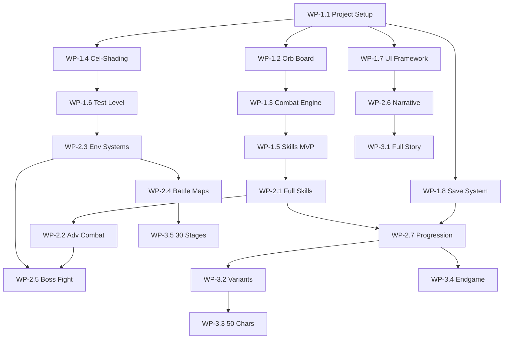

# 《神魔：極限演武》Agent Execution Plan

> Based on full analysis of all 5 GDD documents (6,000+ lines)
> Project has **no code yet** — starting from scratch with Unity + URP

---

## Overview

This plan breaks the GDD into **agent-assignable work packages** across 4 development phases. Each package maps to specific GDD sections and identifies which agent role(s) should execute it.

### Agent Roles

| Agent | Scope | Skills |
|-------|-------|--------|
| **🔧 Engine Agent** | Unity project setup, rendering pipeline, performance | C#, Unity, URP, Shader Graph, HLSL |
| **🎮 Gameplay Agent** | Core mechanics, combat logic, state machines | C#, game math, physics, AI |
| **🎨 Art Agent** | Shaders, VFX, particles, animations, models | Shader Graph, HLSL, particle systems, DOTween |
| **📐 Level Agent** | Maps, environments, terrain, mechanics | Unity scenes, prefabs, scriptable objects |
| **🖥️ UI Agent** | Menus, HUD, Rubik's cube UI, accessibility | Unity UI Toolkit, Canvas, DOTween |
| **📖 Narrative Agent** | Dialogue, quest scripts, cutscenes, localization | JSON/scriptable objects, timeline |
| **🔗 Backend Agent** | Save system, cloud sync, leaderboards, CI/CD | Node.js, Firebase, PostgreSQL, GitHub Actions |
| **🧪 QA Agent** | Testing, profiling, balance tuning | Unity Test Framework, Profiler |

> **Note**: A single agent session can only handle a scoped task — expect each work package below to require **1-5 agent sessions** depending on complexity.

---

## Phase 1: MVP Prototype (Month 0-6)

**Goal**: Prove core gameplay — orb board + 3D combat — is fun. Build a Kickstarter-worthy demo.

---

### WP-1.1: Unity Project Scaffolding
**Agent**: 🔧 Engine Agent
**GDD Source**: [04_technical_architecture.md](file:///d:/antigravitty/TOS/GDD/04_technical_architecture.md) §A

**Tasks**:
1. Create Unity 6 / 2023 LTS project with URP
2. Configure folder structure: `Assets/Scripts/`, `Assets/Shaders/`, `Assets/Prefabs/`, `Assets/Scenes/`, `Assets/Art/`, `Assets/Audio/`, `Assets/Data/`
3. Set up URP pipeline asset (Forward Rendering, MSAA 2x, HDR on, 2 shadow cascades)
4. Configure build targets: PC Standalone, Android, iOS
5. Set up `.gitignore` for Unity, configure Git LFS for art assets
6. Install packages: DOTween, TextMeshPro, Input System (new)
7. Create assembly definitions for modular compilation

**Deliverables**: Bootable Unity project, builds for PC/Android
**Dependencies**: None
**Effort**: 1 agent session

---

### WP-1.2: Core Orb Board System
**Agent**: 🎮 Gameplay Agent (primary), 🎨 Art Agent (VFX)
**GDD Source**: [01_combat_system.md](file:///d:/antigravitty/TOS/GDD/01_combat_system.md) §2, [04_technical_architecture.md](file:///d:/antigravitty/TOS/GDD/04_technical_architecture.md) §C

**Tasks (Gameplay Agent — 3 sessions)**:
1. **Orb Data Model**: 5×6 grid, 6 orb types (Water/Fire/Wood/Light/Dark/Heart), `OrbType` enum, `OrbBoard` class
2. **Orb Board State Machine**: `BoardState` enum (`Idle → PlayerInput → Calculating → Eliminating → Refilling → ChainCheck`)
3. **Drag System**: Cross-platform `IInputProvider` (mouse/touch), min drag distance 10px, snap-to-grid, orb swap on drag-over
4. **Match Detection**: Find all groups of 3+ connected same-color orbs (horizontal/vertical), detect 4-match, 5-match, cross-match, L/T-match patterns
5. **Combo Calculation**: Count combo groups, calculate damage multipliers per GDD table (5 combo=1.5×, 8 combo=2×, 10 combo=2.5×, 15 combo=Exceed Mode 3×)
6. **Skyfall/Cascade**: After elimination, drop orbs down, fill empty slots with random orbs, re-check for matches
7. **Timer System**: 5-second drag timer (configurable per difficulty: 8s casual, 6s hard, 5s hell/nightmare)
8. **Phantom Orb Trail**: Track grid cells visited during drag, count trail length, award bonuses (15+ cells=+20% dmg, 25+=+40%, 30=+60%)
9. **Energy Mark System**: Track per-cell mark levels (Lv1-3) from repeated visits, apply crit bonuses
10. **Awakening Gauge**: Cumulative meter across turns, fills based on trail length

**Tasks (Art Agent — 1 session)**:
1. Orb elimination burst particle system (sphere shape, 20-30 particles, 0.5s lifetime, color-coded)
2. Combo chain visual effect (escalating intensity per 5 combos)
3. Drag trail renderer (Trail Renderer: width 0.3→0.05, time 0.3s, additive glow shader)
4. Motion blur trail (object pool of semi-transparent mesh copies)
5. Snap-to-grid animation (DOTween OutBack ease, 0.2s)

**Deliverables**: Fully functional 5×6 orb board with drag, match, cascade, trail, combo
**Dependencies**: WP-1.1
**Effort**: 4 agent sessions total

---

### WP-1.3: Basic Combat Engine
**Agent**: 🎮 Gameplay Agent
**GDD Source**: [01_combat_system.md](file:///d:/antigravitty/TOS/GDD/01_combat_system.md) §2-3

**Tasks (2 sessions)**:
1. **Turn System**: Hybrid turn flow — `PlayerTurn (pause + 5s orb drag) → ExecutionPhase (3s real-time) → EnemyPhase (2s reaction window)`
2. **Attribute System**: 5 elements + Heart, elemental advantage matrix (Water>Fire>Wood>Water, Light⇄Dark), 1.5× advantage / 0.5× disadvantage
3. **Damage Formula**: `BaseDamage × ComboMultiplier × AttributeMultiplier × TrailBonus × SkillModifiers`
4. **Character Data Model**: `CharacterSO` ScriptableObject — stats (HP, ATK, RCV, SPD), element, rarity, race
5. **Team System**: 5-member party, leader skill slot, friend unit slot
6. **Enemy AI (Basic)**: Lv1 "Novice" — 3-second attack telegraph, single element, no interrupt, simple attack pattern
7. **HP/Damage Display**: Floating damage numbers, HP bars for player team and enemies
8. **CD System**: Per-character active skill cooldown, decrement each player turn, heart orb elimination = CD-1 party-wide

**Deliverables**: Complete battle loop — player orb phase → damage resolution → enemy attack → repeat
**Dependencies**: WP-1.2
**Effort**: 2 agent sessions

---

### WP-1.4: Cel-Shading Renderer
**Agent**: 🎨 Art Agent
**GDD Source**: [04_technical_architecture.md](file:///d:/antigravitty/TOS/GDD/04_technical_architecture.md) §B

**Tasks (2 sessions)**:
1. **Cel-Shading Shader Graph**: NdotL posterization (3 color bands), separate base/shadow/highlight colors, shadow color with hue shift toward cool blue
2. **Fresnel Edge Glow**: `pow(1 - dot(normal, viewDir), 3) * rimColor * rimIntensity`
3. **Outline Pass**: Inverted Hull method — duplicate mesh, extrude along normals by `_OutlineWidth`, Cull Front, solid black
4. **Material Template**: Create base character material, base environment material, orb material (per-element color variant)
5. **LOD Setup**: LOD0 = full cel+outline, LOD1 = cel only, LOD2 = unlit
6. **Camera Setup**: Isometric tactical camera angle (à la Valkyria Chronicles), configurable zoom/pan

**Deliverables**: Working cel-shading pipeline, 3 LOD levels, camera rig
**Dependencies**: WP-1.1
**Effort**: 2 agent sessions

---

### WP-1.5: Character Skills (2-Layer MVP)
**Agent**: 🎮 Gameplay Agent
**GDD Source**: [01_combat_system.md](file:///d:/antigravitty/TOS/GDD/01_combat_system.md) §4

**Tasks (2 sessions)**:
1. **Skill Architecture**: `SkillSO` ScriptableObject — type (Leader/Active), CD, cost, effects array
2. **Effect System**: Modular effect components — `DamageEffect`, `HealEffect`, `BuffEffect`, `OrbConvertEffect`, `ShieldEffect`
3. **Leader Skill Evaluation**: Passive aura applied at battle start, conditional checks (e.g., "per water ally, +15% ATK")
4. **Active Skill Trigger**: Manual activation when CD=0, character portrait glow, execute effect chain
5. **MVP Characters (3)**:
   - **Molly (Water Mage)**: Leader="Sea Resonance" (+15% ATK per water ally), Active="Orb Storm" (destroy non-water orbs, spawn water missiles)
   - **Thor (Lightning God)**: Basic thunder attacker
   - **Iden (Holy Knight)**: Leader="Holy Protection" (-20% DMG taken), Active="Redemption Shield" (shield 1 ally)
6. **Orb Bank System**: UI counter showing accumulated orb eliminations per element (for powerful skill prerequisites)

**Deliverables**: 3 playable characters with leader + active skills
**Dependencies**: WP-1.3
**Effort**: 2 agent sessions

---

### WP-1.6: Test Level — Collapsing Tower
**Agent**: 📐 Level Agent
**GDD Source**: [03_level_environment.md](file:///d:/antigravitty/TOS/GDD/03_level_environment.md) §Map 1

**Tasks (2 sessions)**:
1. **Scene Setup**: Vertical tower scene with 5 layers, ~50m height, ancient stone with glowing runes aesthetic
2. **Platform System**: Modular platform prefabs (stone, broken, floating), connected by stairs/ropes/floating platforms
3. **Collapse Mechanic (Normal difficulty)**: 45-second cycle, red glow warning 8 seconds before, affected platform crumbles away, fall = 30% HP + teleport to safe zone
4. **Height Advantage System**: Attack from 5m+ above = +20% damage, attacking upward = -10% damage
5. **Energy Pillar**: Interactable object, activates temporary energy bridge between disconnected platforms
6. **Teleport Gate**: Ancient portal connecting top/bottom layers, 20s cooldown
7. **Spawn Points**: Enemy spawn locations (3-5 simple enemies), boss spawn at top
8. **NavMesh / Pathfinding**: Basic enemy movement on platforms

**Deliverables**: Playable test level with collapse mechanic
**Dependencies**: WP-1.1, WP-1.4
**Effort**: 2 agent sessions

---

### WP-1.7: MVP UI Framework
**Agent**: 🖥️ UI Agent
**GDD Source**: [04_technical_architecture.md](file:///d:/antigravitty/TOS/GDD/04_technical_architecture.md) §D

**Tasks (2 sessions)**:
1. **Rubik's Cube UI (3 faces only)**: World Space Canvas, DOTween rotation, 3 faces = Main Menu / Character / Stage Select
2. **Swipe Gesture Detection**: 4-direction swipe (up/down/left/right) to rotate cube, pinch to return to center
3. **Context-Aware Input**: Disable cube rotation gestures when touching orb board area
4. **Battle HUD**: HP bars (player team + enemies), skill buttons (5 slots), combo counter, damage numbers, turn indicator, environment info panel
5. **Dual-View Toggle**: Tap orb board area to expand (60% screen), tap 3D area to expand battlefield (80% screen), blur background mode
6. **Pause Menu**: Pause, settings, quit
7. **Scene Transition**: Fade in/out, additive scene loading, loading tips

**Deliverables**: Navigable menu system + complete battle HUD
**Dependencies**: WP-1.1
**Effort**: 2 agent sessions

---

### WP-1.8: Save System (Local Only)
**Agent**: 🔗 Backend Agent
**GDD Source**: [04_technical_architecture.md](file:///d:/antigravitty/TOS/GDD/04_technical_architecture.md) §E.3

**Tasks (1 session)**:
1. **Save Data Model**: JSON schema — player profile, character collection, equipment, stage progress, achievements, settings
2. **Auto-Save Triggers**: After stage completion, character upgrade, every 5 minutes, on app background
3. **AES-256 Encryption**: Encrypt save file to prevent tampering
4. **Save/Load Manager**: `SaveManager.Save()` / `SaveManager.Load()` with checksum validation

**Deliverables**: Reliable local save/load system
**Dependencies**: WP-1.1
**Effort**: 1 agent session

---

### **Phase 1 Total**: ~16 agent sessions

---

## Phase 2: Alpha (Month 6-12)

**Goal**: 20 characters, 15 stages, first 3 story chapters, complete UI flow, closed beta.

---

### WP-2.1: Full Skill System (4-Layer Progressive Unlock)
**Agent**: 🎮 Gameplay Agent
**GDD Source**: [01_combat_system.md](file:///d:/antigravitty/TOS/GDD/01_combat_system.md) §4

**Tasks (3 sessions)**:
1. **Passive Skills**: Triggered automatically on conditions (HP threshold, combo count, element match)
2. **Exceed/Awakening Skills**: Consume 100 awakening gauge, powerful ultimate — full-screen animation + devastating effect
3. **Buff/Debuff System**: Timed status effects (ATK up, DEF down, poison, freeze, stun, shield), stack management, visual indicators
4. **Character Implementation (17 more)**: Expand roster to 20, including Lucifer (Fallen), Lucifer (Radiant), Satan, Michael, Freya, and basic summon beasts
5. **Skill Balancing**: CD vs Orb Cost vs Damage output table per GDD §3.1

**Dependencies**: WP-1.5
**Effort**: 3 sessions

---

### WP-2.2: Advanced Combat Mechanics
**Agent**: 🎮 Gameplay Agent
**GDD Source**: [01_combat_system.md](file:///d:/antigravitty/TOS/GDD/01_combat_system.md) §2-3

**Tasks (2 sessions)**:
1. **Combo Shield**: Boss mechanic — energy barrier requiring N combos to break
2. **Pre-Attack Shield**: Boss invincibility until environmental trigger destroyed
3. **Combo Interrupt**: Enemy ability to break combo chain mid-execution
4. **Exceed Mode**: 15+ combos = party ATK ×3, ignore DEF, +3s next turn timer
5. **Dynamic Orb Board Events**: Locked orbs (chain VFX), interference orbs, bomb orbs, spatial rifts (blocked cells)
6. **Enemy AI (Lv2-4)**: Graduated AI complexity per GDD §3.4 — shorter telegraphs, combo shields, attribute shields, dynamic board manipulation
7. **Terrain Attribute Bonuses**: Positional advantage/disadvantage based on terrain element

**Dependencies**: WP-2.1
**Effort**: 2 sessions

---

### WP-2.3: Environment Systems
**Agent**: 📐 Level Agent (primary), 🎨 Art Agent (VFX)
**GDD Source**: [03_level_environment.md](file:///d:/antigravitty/TOS/GDD/03_level_environment.md) §1-3

**Tasks (Level Agent — 3 sessions)**:
1. **Gravity System**: Standard(1G), Low(0.3G), High(2G), Reverse(-1G) — affects character jump/speed and orb board physics
2. **Elemental Terrain**: 5 terrain types (Water, Fire, Electromagnetic, Shadow, Chaos) each with visual effects, stat modifiers, orb drop rate changes
3. **Weather System**: Clear, Rain, Storm, Snow, Sandstorm — each with elemental damage modifiers and visual effects
4. **Day/Night Cycle**: 3 phases (Day/Dusk/Night) + rare Blood Moon event
5. **Destructible Cover**: Stone pillars, ice walls, energy barriers — HP, elemental weakness
6. **Moving Platforms**: Timed elevators, weight-triggered, switch-activated
7. **Teleport Gates**: Fixed pairs, random rifts, one-way, element-locked
8. **Environmental Traps**: Ground spikes, poison vents, explosion runes, debuff auras
9. **Level Config System**: JSON-based difficulty configuration (per GDD technical spec)

**Tasks (Art Agent — 1 session)**:
1. Terrain visual effects (water ripples, lava glow, electricity arcs, shadow fog)
2. Weather particle systems
3. Platform collapse VFX (dust, debris, shockwave)

**Dependencies**: WP-1.6
**Effort**: 4 sessions

---

### WP-2.4: 3 Representative Battle Maps
**Agent**: 📐 Level Agent
**GDD Source**: [03_level_environment.md](file:///d:/antigravitty/TOS/GDD/03_level_environment.md) §Maps 1-3

**Tasks (3 sessions)**:
1. **Collapsing Tower (Full)**: All difficulty variants (Normal 45s → Nightmare 10s collapse)
2. **Temporal Rift Junction**: 5 elemental zones that rotate every 25s, time-speed anomalies, chaos zone expansion
3. **Abyss Frontline**: Environmental erosion, lava tides, debuff obelisks, 15-min hard timer
4. Each map × 4 difficulty variants = 12 configurations total

**Dependencies**: WP-2.3
**Effort**: 3 sessions

---

### WP-2.5: Boss Fight — Tianli & Destiny
**Agent**: 🎮 Gameplay Agent (AI), 📐 Level Agent (arena)
**GDD Source**: [03_level_environment.md](file:///d:/antigravitty/TOS/GDD/03_level_environment.md) §Boss Fight

**Tasks (2 sessions)**:
1. **Dual Boss System**: HP sync check, mutual revival mechanic, simultaneous kill window (10s)
2. **Phase 1 (100-70%)**: Separate attack patterns — Tianli (ranged beam, combo shield, element seal zone), Destiny (shadow dash, fate thread, dark clones)
3. **Phase 2 (70-30%)**: Combined attacks — yin-yang vortex, cross judgment, dual seal
4. **Phase 3 (30-0%)**: Symbiosis (shared HP), sync charge (30s, destroy 4 pillars or instant-kill), enrage
5. **Arena Environment**: Light/Dark altars, gravity inversion switches, Fate Mirror (swap boss elements)

**Dependencies**: WP-2.2, WP-2.3
**Effort**: 2 sessions

---

### WP-2.6: Narrative System & Main Story (Ch. 0-3)
**Agent**: 📖 Narrative Agent
**GDD Source**: [02_narrative_worldbuilding.md](file:///d:/antigravitty/TOS/GDD/02_narrative_worldbuilding.md) §3-4

**Tasks (3 sessions)**:
1. **Dialogue System**: `DialogueSO` ScriptableObject, character portraits, text box, auto/skip, branching choices
2. **Cutscene Framework**: Unity Timeline integration, Live2D-style character animation, camera choreography
3. **Prologue Script**: Tutorial + Tower collapse, ~5,000 words
4. **Chapter 1 Script**: "Disordered Rikaser" — Thor encounter, temporal rifts, Mechanical Thor boss, ~8,000 words
5. **Chapter 2 Script**: "Light & Shadow" — Fallen vs Radiant Lucifer, identity crisis, ~8,000 words
6. **Chapter 3 Script**: "Ancient Awakening" — Pangu/Nuwa, consciousness battle, ~9,000 words
7. **Character Biography System**: Per-character story entries (20 chars × 800 words)
8. **Quest Log/Journal UI**: Track main/side quests, history fragments

**Dependencies**: WP-1.7
**Effort**: 3 sessions

---

### WP-2.7: Character Progression System
**Agent**: 🎮 Gameplay Agent
**GDD Source**: [01_combat_system.md](file:///d:/antigravitty/TOS/GDD/01_combat_system.md) §5

**Tasks (2 sessions)**:
1. **Character Unlock System**: Main storyline unlock (chapter completion rewards), side quest unlock, boss first-clear unlock
2. **Fragment Synthesis**: SSR = 100 fragments, fixed drop sources (weekly dungeon, daily quest exchange, achievements, world exploration)
3. **Evolution Material System**: T1-T4 tiers (Element Crystal → Attribute Essence → Awakening Proof → Origin Core)
4. **Daily Dungeons**: Mon=Fire, Tue=Water, Wed=Wood, Thu=Light, Fri=Dark, Sat=Awakening, Sun=Gold — 3 difficulty tiers with stamina costs
5. **Player Level System**: 4 progression stages (Lv1-30 learn, Lv31-60 build team, Lv61-100 specialize, Lv100+ endgame)
6. **Character Growth Roadmap UI**: Visual progression tree per character

**Dependencies**: WP-1.8, WP-2.1
**Effort**: 2 sessions

---

### WP-2.8: Cross-Platform Input & Quality Settings
**Agent**: 🔧 Engine Agent
**GDD Source**: [04_technical_architecture.md](file:///d:/antigravitty/TOS/GDD/04_technical_architecture.md) §E

**Tasks (1 session)**:
1. **IInputProvider Interface**: `MouseInputProvider` (PC), `TouchInputProvider` (mobile), auto-detect
2. **Device Tier Detection**: Low/Medium/High/Ultra based on RAM + GPU memory
3. **Quality Presets**: Per-tier URP asset — render scale, MSAA, shadow distance, post-processing toggle
4. **Dynamic Resolution**: Runtime FPS monitoring → scale 0.6-1.2
5. **Thermal Management**: Monitor device temp, throttle to 30fps at >45°C

**Dependencies**: WP-1.1
**Effort**: 1 session

---

### WP-2.9: A/B Testing Framework
**Agent**: 🧪 QA Agent
**GDD Source**: [05_critique_final_summary.md](file:///d:/antigravitty/TOS/GDD/05_critique_final_summary.md) §Verification

**Tasks (1 session)**:
1. **Orb Time A/B Test**: Compare 5s vs 8s vs unlimited-before-drag timer settings
2. **Analytics Events**: Track combo average, trail length, stage completion rate, death locations, play session length
3. **Feedback Survey Framework**: In-game popup after test sessions

**Dependencies**: WP-1.2, WP-1.3
**Effort**: 1 session

---

### **Phase 2 Total**: ~21 agent sessions

---

## Phase 3: Beta (Month 12-18)

**Goal**: 50 characters, 30 stages, full main story, public beta.

---

### WP-3.1: Full Story (Ch. 4-5 + Endings)
**Agent**: 📖 Narrative Agent
**GDD Source**: [02_narrative_worldbuilding.md](file:///d:/antigravitty/TOS/GDD/02_narrative_worldbuilding.md) §4 (Ch.4-Finale)

**Tasks (3 sessions)**:
1. **Chapter 4 Script**: "Mechanical Future" — Future city Orozu, Proto-Machina boss, ~7,000 words
2. **Chapter 5 Script**: "Truth & Betrayal" — Time Layer, Future Enoch reveal, Absolute Void, ~8,000 words
3. **Finale Scripts (3 endings)**: Ending A (Perfect Timeline), B (Infinite Possibilities), C (Hidden — Beyond Time)
4. **Branching Logic**: Choice flags, ending calculation system, ending replay viewer
5. **Post-game Epilogue**: Accessible after any ending

**Dependencies**: WP-2.6
**Effort**: 3 sessions

---

### WP-3.2: Character Variant System
**Agent**: 🎮 Gameplay Agent + 📖 Narrative Agent
**GDD Source**: [02_narrative_worldbuilding.md](file:///d:/antigravitty/TOS/GDD/02_narrative_worldbuilding.md) §5

**Tasks (2 sessions)**:
1. **Variant Data Model**: Link variants to base character, variant categories (Historical Divergence, Era Evolution, Fusion, Future Echo, Special)
2. **Resonance System**: Same-character variants in party → special dialogue + buff
3. **Contradiction System**: Opposing variants → debuff (removable via story unlock "reconciliation")
4. **Fusion Skills**: Specific variant combos → ultimate combined attack
5. **Variant Gallery**: Visual branching tree showing all variants per character

**Dependencies**: WP-2.7
**Effort**: 2 sessions

---

### WP-3.3: Expand to 30 Characters + Variants
**Agent**: 🎮 Gameplay Agent
**GDD Source**: [01_combat_system.md](file:///d:/antigravitty/TOS/GDD/01_combat_system.md) §4, [02_narrative_worldbuilding.md](file:///d:/antigravitty/TOS/GDD/02_narrative_worldbuilding.md) §5

**Tasks (3 sessions)**:
1. Implement 30 additional characters/variants reaching 50 total
2. Balance 4-layer skill sets across all characters
3. Implement special characters: Judgment Lucifer, Awakened Pangu, Future Guardian, Future Enoch
4. Set up character biography quests for new characters

**Dependencies**: WP-3.2
**Effort**: 3 sessions

---

### WP-3.4: Endgame Systems
**Agent**: 🎮 Gameplay Agent
**GDD Source**: [01_combat_system.md](file:///d:/antigravitty/TOS/GDD/01_combat_system.md) §5.4

**Tasks (2 sessions)**:
1. **Infinite Tower**: Rogue-like 100-floor tower, difficulty escalation, checkpoint every 10 floors, tiered rewards
2. **Arena (Async PvP)**: Challenge other players' defense teams (AI-controlled), 5 free attempts/day, honor currency
3. **Guild System**: Guild boss raids, guild shop, weekly guild events
4. **Achievement System**: Milestone tracking, special unlocks (e.g., "Defeat Radiant Lucifer with Fallen Lucifer 10 times")

**Dependencies**: WP-2.7
**Effort**: 2 sessions

---

### WP-3.5: 15 Additional Stages + 4 Difficulty Variants Each
**Agent**: 📐 Level Agent
**GDD Source**: [03_level_environment.md](file:///d:/antigravitty/TOS/GDD/03_level_environment.md) §Difficulty Progression

**Tasks (3 sessions)**:
1. Design 15 new stages covering all story chapters (4-5 + endgame)
2. Configure 4 difficulty tiers per stage (Normal/Hard/Hell/Nightmare) with escalating mechanics per GDD difficulty table
3. Implement "impossible mechanic" solutions for Nightmare (hidden patterns, reverse-use mechanics)
4. Set up daily dungeon rotation stages (7 element-themed)

**Dependencies**: WP-2.3, WP-2.4
**Effort**: 3 sessions

---

### WP-3.6: Anti-Churn & Social Systems
**Agent**: 🎮 Gameplay Agent + 🔗 Backend Agent
**GDD Source**: [01_combat_system.md](file:///d:/antigravitty/TOS/GDD/01_combat_system.md) §5.5

**Tasks (2 sessions)**:
1. **Daily Login Rewards**: 7-day cycle, 30-day cumulative (SSR fragments at day 30), non-punitive restart
2. **Returning Player Bonus**: 7+ days offline → 3 days double drops + universal fragments
3. **Mentor System**: Veteran-newbie pairing with mutual rewards
4. **Friend Support**: Borrow friend's character (3/day), friendship points
5. **Friend List + Social Feed**: Basic backend support

**Dependencies**: WP-2.7
**Effort**: 2 sessions

---

### WP-3.7: Cloud Save + Hotfix System
**Agent**: 🔗 Backend Agent
**GDD Source**: [04_technical_architecture.md](file:///d:/antigravitty/TOS/GDD/04_technical_architecture.md) §E.3-5

**Tasks (2 sessions)**:
1. **Firebase Integration**: Cloud save upload/download, timestamp-based conflict resolution, player-choice merge UI
2. **Account System**: Firebase Auth / OAuth (Google, Apple)
3. **AssetBundle Hot Update**: CDN-based versioned bundles, download diff on launch, restart prompt
4. **Leaderboard API**: POST scores, GET rankings (Redis-cached), display in-game
5. **Server-Side**: Node.js + Express REST API, PostgreSQL for accounts, Redis for leaderboard

**Dependencies**: WP-1.8
**Effort**: 2 sessions

---

### WP-3.8: Accessibility & Localization
**Agent**: 🖥️ UI Agent
**GDD Source**: [04_technical_architecture.md](file:///d:/antigravitty/TOS/GDD/04_technical_architecture.md) §D.4

**Tasks (1 session)**:
1. **Color Blind Mode**: Deuteranopia / Protanopia filter shaders
2. **High Contrast Mode**: WCAG AA compliant (4.5:1 contrast ratio)
3. **Font Scaling**: 80-150% UI text size
4. **Subtitles**: All voiced dialogue
5. **Single-Hand Mode**: Bottom-aligned critical buttons
6. **Auto-Battle**: AI plays orb board for accessibility
7. **Localization Framework**: TextMeshPro + localization tables (Traditional Chinese, Simplified Chinese, English)

**Dependencies**: WP-1.7
**Effort**: 1 session

---

### WP-3.9: Audio System
**Agent**: 🎨 Art Agent (integration)
**GDD Source**: Implied across all GDDs

**Tasks (1 session)**:
1. **Audio Manager**: BGM, SFX, voice channels with volume control
2. **Battle Audio**: Orb drag SFX, elimination burst, combo escalation, skill activation, hit impacts
3. **Environmental Audio**: Ambient per terrain type, weather sounds, collapse rumble
4. **UI Audio**: Menu transitions, button clicks, cube rotation
5. **Haptic Feedback**: Mobile vibration on orb elimination

**Dependencies**: WP-1.1
**Effort**: 1 session

---

### **Phase 3 Total**: ~19 agent sessions

---

## Phase 4: Release (Month 18-24)

**Goal**: Final polish, app store submission, open-source server code.

---

### WP-4.1: Performance Optimization
**Agent**: 🧪 QA Agent + 🔧 Engine Agent
**GDD Source**: [04_technical_architecture.md](file:///d:/antigravitty/TOS/GDD/04_technical_architecture.md) §F

**Tasks (2 sessions)**:
1. **Profiling**: Unity Profiler on target devices (Snapdragon 778G, A13), identify bottlenecks
2. **Draw Call Optimization**: Static batching, GPU instancing, SRP Batcher, texture atlasing
3. **Memory Management**: Object pooling for all VFX, AssetBundle tiered loading, texture compression (ASTC/ETC2/BC7)
4. **Loading Optimization**: Async scene loading <3s, shader warm-up, pre-loading, fun loading screen
5. **Legacy Mode**: Fallback rendering for low-end devices (no outline, no particles, 2D orb board, 720p)

**Dependencies**: All prior WPs
**Effort**: 2 sessions

---

### WP-4.2: CI/CD Pipeline
**Agent**: 🔗 Backend Agent
**GDD Source**: [04_technical_architecture.md](file:///d:/antigravitty/TOS/GDD/04_technical_architecture.md) §A.5

**Tasks (1 session)**:
1. **GitHub Actions**: Auto-test on push (Unity Test Framework — Playmode + Editmode)
2. **Auto-Build**: Weekly Alpha/Beta APK/IPA/EXE packaging
3. **Release Flow**: Manual trigger for production builds, semantic versioning
4. **Upload**: Auto-upload to TestFlight / Google Play Beta

**Dependencies**: WP-1.1
**Effort**: 1 session

---

### WP-4.3: Comprehensive Testing & Balance
**Agent**: 🧪 QA Agent
**GDD Source**: [05_critique_final_summary.md](file:///d:/antigravitty/TOS/GDD/05_critique_final_summary.md) §Verification Assumptions

**Tasks (2 sessions)**:
1. **Unit Tests**: Orb match detection, damage formula, combo calculation, CD system, save/load integrity
2. **Integration Tests**: Full battle flow, skill interactions, environmental mechanic triggers
3. **Playtest Data Collection**: 50-player closed test — track Day 7/30 retention, average combo, stage clear rates
4. **Balance Tuning**: Ensure Normal=80%+ clear, Hard=50%+, Hell=20%+, Nightmare=<5% clear rates
5. **Bug Triage**: Critical bug resolution before release

**Dependencies**: All prior WPs
**Effort**: 2 sessions

---

### WP-4.4: App Store Preparation
**Agent**: 🔗 Backend Agent + 🖥️ UI Agent
**GDD Source**: Implied

**Tasks (1 session)**:
1. **Store Listings**: Screenshots, description, trailer video reference
2. **Privacy Policy / Terms**: Required for iOS/Android
3. **App Icons & Splash Screen**: Final branding assets
4. **Open Source Server**: Publish server code + self-hosting documentation

**Dependencies**: All prior WPs
**Effort**: 1 session

---

### **Phase 4 Total**: ~6 agent sessions

---

## Grand Total Summary

| Phase | Months | Agent Sessions | Key Milestone |
|-------|--------|---------------|---------------|
| **Phase 1: MVP** | 0-6 | ~16 | Demo for Kickstarter |
| **Phase 2: Alpha** | 6-12 | ~21 | Closed beta (20 chars, 15 stages) |
| **Phase 3: Beta** | 12-18 | ~19 | Public beta (50 chars, 30 stages) |
| **Phase 4: Release** | 18-24 | ~6 | v1.0 launch on stores |
| **Total** | 24 months | **~62 sessions** | — |

---

## Cross-Document Dependencies

---

## Verification Plan

Since the project has no existing tests or code, verification is purely **forward-looking**:

### Automated Tests (added during development)
- **Unit tests** via Unity Test Framework (EditMode):
  - Orb match detection (3-match, 4-match, cross, L/T)
  - Combo counting
  - Damage formula with attribute modifiers
  - Cascade/skyfall logic
  - Save/Load + encryption integrity
- **Playmode tests**:
  - Full battle loop (start → orb drag → combo resolve → enemy turn → repeat)
  - Skill activation and effect application
  - Environment mechanic triggers (collapse, element zone transitions)

### Manual Verification
- **Orb drag feel**: Compare to original Tower of Saviors simulator ([louisalflame.github.io/TOSwebsite/canvas.html](https://louisalflame.github.io/TOSwebsite/canvas.html)) — should feel equally smooth
- **FPS benchmark**: Run Unity Profiler on Snapdragon 778G equivalent device, confirm ≥30fps in battle
- **Kickstarter readiness**: MVP demo should be compelling enough for a 3-minute gameplay video

> [!IMPORTANT]
> This is a **planning document** — no code changes involved. The user should review whether the work package breakdown, agent assignments, and phasing match their vision before any execution begins.
